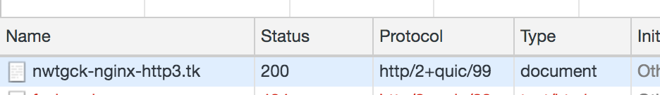

# docker-nginx-http3
[](https://github.com/nwtgck/docker-nginx-http3/actions) [](https://microbadger.com/images/nwtgck/nginx-http3 "Get your own image badge on microbadger.com")

Docker image for Nginx + HTTP/3 powered by [Quiche](https://github.com/cloudflare/quiche)

## Docker Hub
[nwtgck/nginx-http3 - Docker Hub](https://hub.docker.com/r/nwtgck/nginx-http3)
```bash
docker pull nwtgck/nginx-http3
```

## Example
Here is an example using this image with Docker Compose.
- [Reverse proxy example using Docker Compose](https://github.com/nwtgck/ghost-nginx-http3-docker-compose)  

`nginx.conf` in the example might help you to know how to use this image.

## HTTP/3 in Google Chrome Canary


(`http/2+quic/99` means HTTP/3)  

In macOS, you can run Chrome Canary
 by `/Applications/Google\ Chrome\ Canary.app/Contents/MacOS/Google\ Chrome\ Canary --enable-quic --quic-version=h3-23`, enabling HTTP/3 feature.  
(ref: [HTTP/3: the past, the present, and the future](https://blog.cloudflare.com/http3-the-past-present-and-future/))
